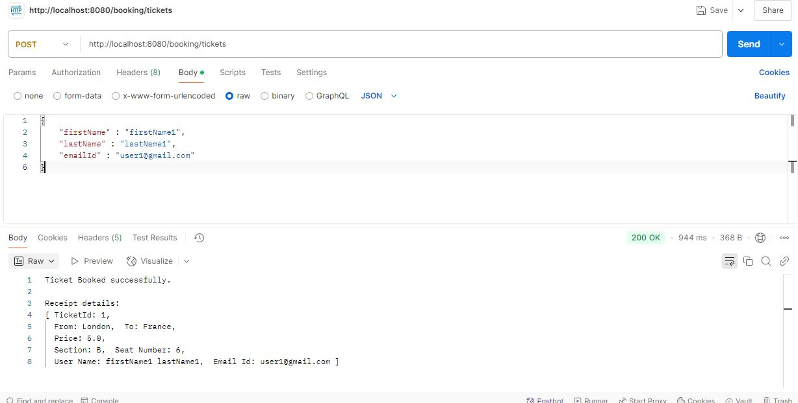
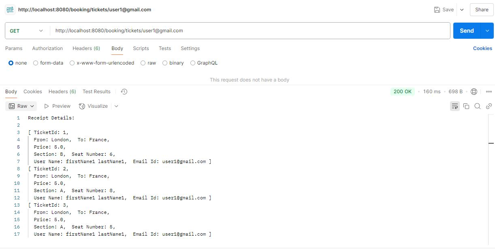
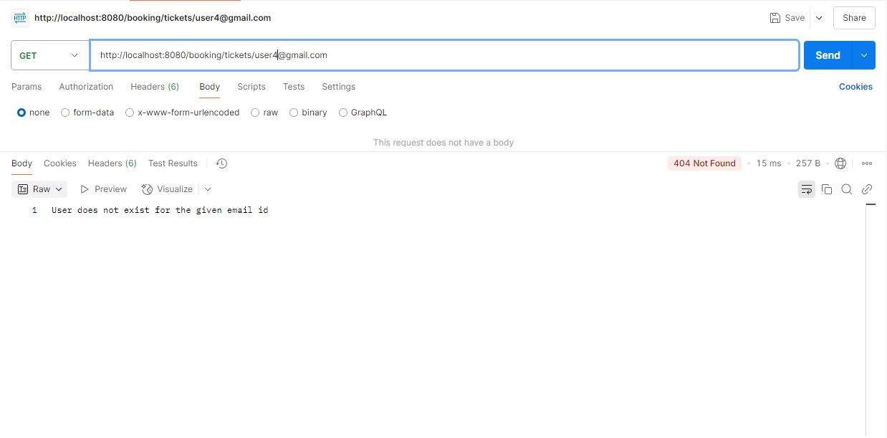
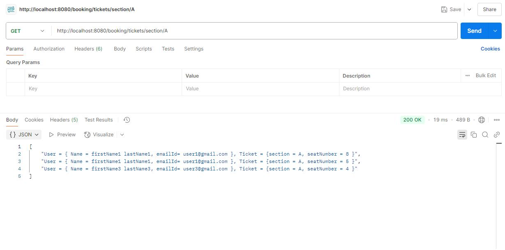
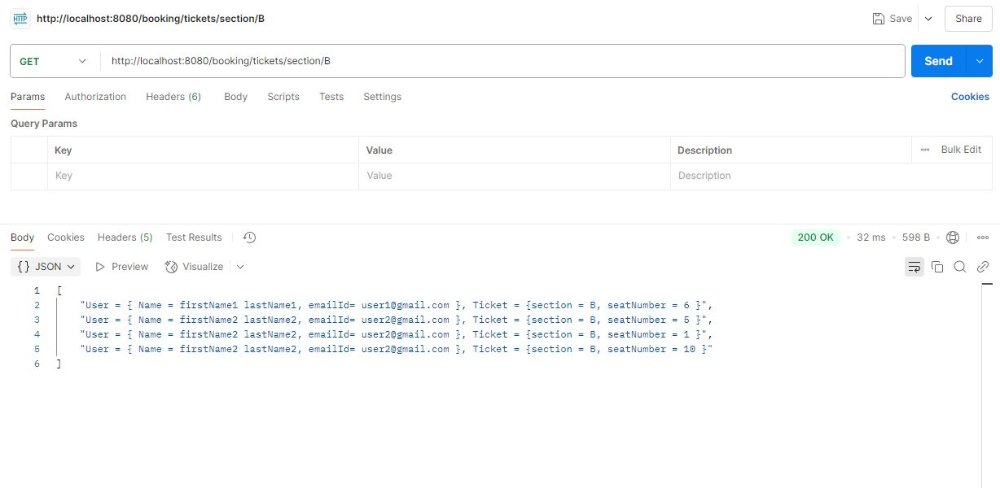
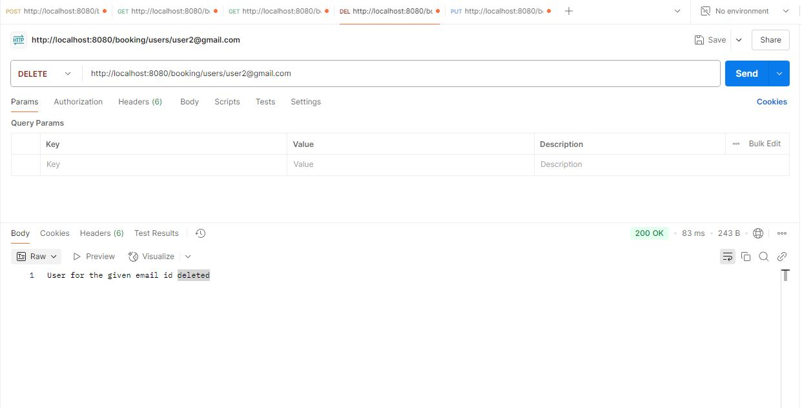
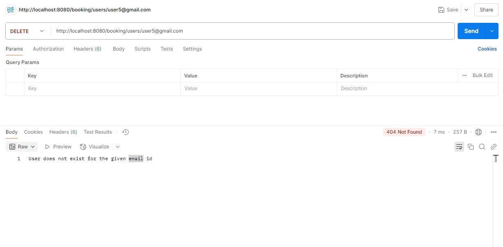
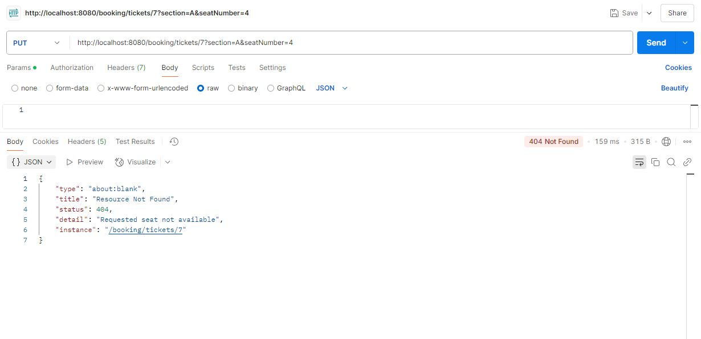
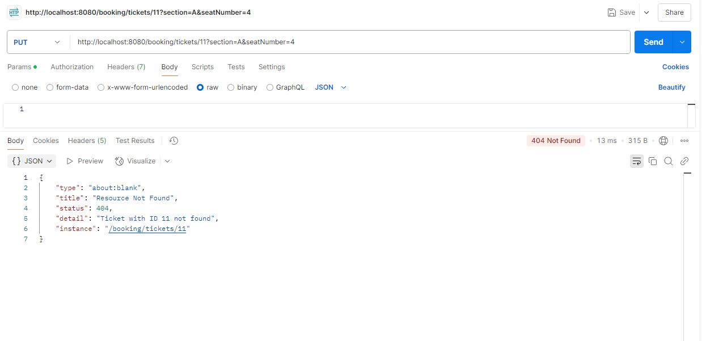
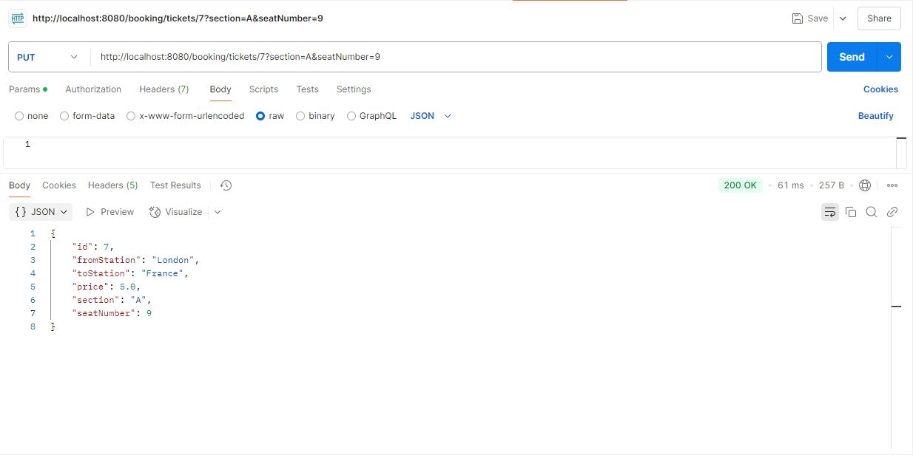

# Train Ticket Booking Application
### A simple Spring Boot application for booking train tickets with various features/functionalities as explained below.

## Features

- Book ticket for the user
- Modify seat selection after booking
- View tickets by user
- View users by train section (A or B)
- Delete a user and release their seats
- In-memory H2 database for easy testing

## Technologies Used

- Java
- Spring Boot
- Spring Data JPA
- H2 Database
- Lombok
- JUnit
- Mockito

## Project Structure

- `entity/` - JPA entities (`User`, `Ticket`)
- `dto/` - DTO Class (`Receipt`) - Record is used for this.
- `repository/` - Spring Data JPA repositories
- `service/` - Business logic for booking
- `controller/` - REST API controllers
- `application.properties` - App configurations

## API Endpoints Details:

### API 1: 
**Summary:** Book a ticket for the user  
**Description:**  
  Book a ticket with given user information.  
  The Section and Seat are selected randomly.  
  Check if any seat is available and book accordingly.  
  Return result in the form of Receipt.  
**Input:** User (firstName, lastName, emailId)  
**Output:** Receipt (fromStation, toStation, User, pricePaid)  
****URL:**** POST: 'http://localhost:8080/booking/tickets'  
****Sample Request:****  
	{  
		"firstName" : "firstName1",  
		"lastName" : "lastName1",  
		"emailId" : "user1@gmail.com"  
	}  
**Sample Response:**  
Ticket Booked successfully.  

	Receipt details:  
	[ TicketId: 6,  
	  From: London,  To: France,  
	  Price: 5.0,  
	  Section: A,  Seat Number: 5,  
	  User Name: firstName1 lastName1,  Email Id: user1@gmail.com ]  

**Testing Screenshots:**

### API 2: 
**Summary:** Get Receipt details for given user  
**Description:**   
  Assumping that the every user will have an associated email id.  
  Gets list of tickets that the user had booked.  
  Build corresponding Receipt for each Tickets booked and return it.  
**Input:** emailId  
**Output:** Receipt (fromStation, toStation, userFullName, userEmailId, pricePaid)  
**URL:** GET: 'http://localhost:8080/booking/tickets/user1@gmail.com'  
**Sample Request:**  
	N/A  
**Sample Response:**  
	Receipt Details:  

	[ TicketId: 1,  
	  From: London,  To: France,  
	  Price: 5.0,  
	  Section: A,  Seat Number: 10,  
	  User Name: firstName1 lastName1,  Email Id: user1@gmail.com ]  
	[ TicketId: 2,  
	  From: London,  To: France,  
	  Price: 5.0,  
	  Section: A,  Seat Number: 4,  
	  User Name: firstName1 lastName1,  Email Id: user1@gmail.com ]  
	[ TicketId: 3,  
	  From: London,  To: France,  
	  Price: 5.0,  
	  Section: A,  Seat Number: 7,  
	  User Name: firstName1 lastName1,  Email Id: user1@gmail.com ]  
	[ TicketId: 4, 
	  From: London,  To: France,  
	  Price: 5.0,  
	  Section: B,  Seat Number: 2,  
	  User Name: firstName1 lastName1,  Email Id: user1@gmail.com ]  

**Testing Screenshots:**

### API 3:  
**Summary:** View the list of users and the seat they are allocated by the given section  
**Description:**   
  description  
**Input:** section  
**Output:** Refer sample response  
**URL:** GET 'http://localhost:8080/booking/tickets/section/A'  
**Sample Request:**  
	N/A  
**Sample Response:**  
	[  
		"User = { Name = firstName1 lastName1, emailId= user1@gmail.com }, Ticket = {section = A, seatNumber = 10 }",  
		"User = { Name = firstName1 lastName1, emailId= user1@gmail.com }, Ticket = {section = A, seatNumber = 4 }",  
		"User = { Name = firstName1 lastName1, emailId= user1@gmail.com }, Ticket = {section = A, seatNumber = 7 }",  
		"User = { Name = firstName2 lastName2, emailId= user2@gmail.com }, Ticket = {section = A, seatNumber = 9 }"  
	] 

**Testing Screenshots:**

### API 4:  
**Summary:** Delete user by Email Id 
**Description:**   
  Based on the given email id, check for the ticket table first and delete the records.  
  Then delete the corresponding records from users table.  
**Input:** Email Id  
**Output:** Message to user.  
**URL:** DELETE 'http://localhost:8080/booking/users/user1@gmail.com'  
**Sample Request:**  
	N/A  
**Sample Response:**  
	User does not exist for the given email id  
					( or )  
	User for the given email id deleted  

**Testing Screenshots:**

### API 5:  
**Summary:** Modify seat details  
**Description:**   
  For a given ticket id, change the seat details.  
  Check if the ticket id is present.  
  If yes, check if the given section and seat number is still available.  
  If yes, change the seat details and update the ticket object.  
**Input:** existing ticketId, new section, new seatNumber.  
**Output:** Modified Ticket details.  
**URL:** PUT: 'http://localhost:8080/booking/tickets/6?section=A&seatNumber=1'  
**Sample Request:**  

**Sample Response:**  
	{  
		"id": 6,  
		"fromStation": "London",  
		"toStation": "France",  
		"price": 5.0,  
		"section": "A",					// New section  
		"seatNumber": 1					// New seat number  
	}  

**Testing Screenshots:**

